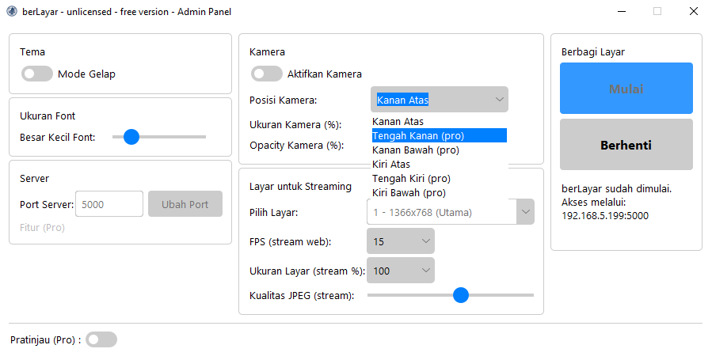

# Apa itu berLayar – Berbagi Layar Secara Lokal??

**berLayar** adalah aplikasi ringan untuk berbagi tampilan layar komputer Anda secara **lokal** ke perangkat lain melalui browser, tanpa perlu koneksi internet atau instalasi tambahan di sisi penerima.

Aplikasi ini berjalan secara **offline** di jaringan lokal (LAN/WiFi), dan dapat diakses melalui browser seperti Google Chrome, Edge, Firefox, atau Safari dari perangkat lain (laptop, tablet, atau ponsel).

---

## Fitur

- **Streaming langsung** tampilan layar Anda ke perangkat lain
- **Akses melalui browser** — tidak perlu instal di client
- **Tidak butuh internet**, cukup berada di jaringan yang sama
- **Bisa dikustomisasi** (logo, teks, dan tampilan halaman)
- Privasi terjaga karena hanya berjalan di jaringan lokal Anda

---

## Produk berLayar

### 1) berLayar Lite _(Gratis)_
- **Console-only** (tanpa GUI).
- Hanya membagikan layar utama.
- Tidak ada kustomisasi (monitor, FPS, kualitas).
- Menghentikan stream dengan menutup console.
- Ringan, cocok untuk **komputer low-end**.

### 2) berLayar _(Gratis)_
- **GUI Admin Panel** lengkap.
- Pilihan FPS/kualitas/skala.
- **Kamera PiP** (posisi/ukuran/opacity).
- Tema gelap/terang & ukuran font.

### 3) berLayar Pro _(Berbayar — Windows)_
- Semua fitur di **berLayar** +
  - **Pilih Layar Monitor** Layar Utama/Layar External
  - **Pratinjau** sebelum berbagi layar
  - **Timer** durasi sesi
  - **Kustomisasi** `index.html` & logo viewer
- Solusi lengkap untuk penggunaan **profesional**.

### 4) Exclusive Build — Platform Edition _(Berbayar — macOS/Linux)_
- Turunan dari **berLayar Pro**.
- Fitur disesuaikan kemampuan platform.
- Distribusi terbatas; hanya melalui pemesanan khusus.

---

## Spesifikasi Sistem

> Fokus utama rilis publik saat ini adalah **Windows**. Paket Exclusive Build melayani macOS/Linux secara khusus (non-publik).

| Build | OS | CPU Minimal | RAM | Display | Jaringan | Catatan |
|-------|----|-------------|-----|---------|----------|---------|
| **Lite** | Windows 10/11 (64-bit) | Dual-core i3 gen4 / setara | 2 GB (disarankan 4 GB) | 1366×768 | Wi-Fi 4 / LAN | Tidak perlu kamera |
| **berLayar** | Windows 10/11 (64-bit) | Dual-core i3 gen6 / Ryzen 3 | 4 GB (disarankan 8 GB) | 1920×1080 | Wi-Fi 5/6 / LAN Gigabit | Kamera diperlukan untuk PiP |
| **Pro** | Windows 10/11 (64-bit) | Dual-core i3 gen6 / Ryzen 3 | 4 GB (disarankan 8 GB) | 1920×1080 | Wi-Fi 5/6 / LAN Gigabit | Kamera diperlukan untuk PiP |
| **Exclusive Build** | macOS / Linux | Setara Pro | Sesuai OS | Sesuai OS | Sesuai OS | Integrasi manual; fitur menyesuaikan |

---

## Perbandingan Fitur

| Fitur | Lite | berLayar | Pro | Exclusive Build |
|-------|------|----------|-----|-----------------|
| Jalankan dengan double-click | ✔ | ✔ | ✔ | ✔ |
| Streaming layar utama | ✔ | ✔ | ✔ | ✔ |
| Menghentikan stream dengan tutup console | ✔ | ✔ | ✔ | ✔ |
| GUI Admin Panel | ✘ | ✔ | ✔ | ✔ |
| Pilih monitor yang ingin dibagikan | ✘ | ✘ | ✔ | ✔* |
| Atur FPS (5–30) | ✘ | ✔** | ✔ | ✔ |
| Atur kualitas JPEG (30–100) | ✘ | ✔** | ✔ | ✔ |
| Atur skala ukuran layar (50–100%) | ✘ | ✔** | ✔ | ✔ |
| Integrasi kamera (PiP) | ✘ | ✔ | ✔ | ✔* |
| Atur posisi/ukuran/opacity kamera | ✘ | ✔** | ✔ | ✔* |
| Tema gelap/terang & ukuran font UI | ✘ | ✔ | ✔ | ✔ |
| **Pratinjau sebelum berbagi layar** | ✘ | ✘ | ✔ | ✔* |
| **Timer durasi sesi** | ✘ | ✘ | ✔ | ✔* |
| **Kustomisasi `index.html` & logo viewer** | ✘ | ✘ | ✔ | ✔ |

> \* Ketersediaan di **Exclusive Build** tergantung platform dan integrasi yang diinginkan.
> \*\* Fitur terbatas.

---

## Tampilan
**Console — Lite Edition**  


**Gui — berLayar**


**GUI — Pro Edition (Dark)**


**GUI — Pro Edition (Preview Load)**


**Viewer — Browser Client — Versi Gratis — Mobile Phone — Portrait**


**Viewer — Browser Client — Versi Gratis — Tablet — Landscape**


---

## Cara Pemasangan

### dua langkah mudah

1. Masuk kedalam folder dist, terdapat dua pilihan versi berLayar dan versi berLayar lite.
2. Unduh dan kemudian jalankan dari manapun tanpa perlu melakukan instalasi.

---

## Cara Menggunakan

### berLayar Lite
> Lihat panduan penggunaan di folder [docs/user-guide/berLayar-lite.md](docs/user-guide/berLayar-lite.md).

1. **Jalankan file `berLayar.exe`**  
   (cukup klik dua kali)

2. Setelah terbuka, aplikasi akan menampilkan alamat IP lokal seperti:
   ```bash
    Akses aplikasi dari web browser dan masukkan URL:
    192.168.1.10:2025 (ini hanya contoh, IP akan menyesuaikan dengan subnet router/jaringan Anda)

3. **Buka browser di perangkat lain** (yang terhubung ke jaringan WiFi/LAN yang sama), lalu akses:
   ```bash
    http://192.168.1.10:2025

4. Anda akan melihat tampilan layar dari komputer pengirim secara langsung di browser.
   Catatan: Pastikan firewall tidak memblokir koneksi ke port 2025.

### berLayar
> Lihat panduan penggunaan di folder [docs/user-guide/berLayar.md](docs/user-guide/berLayar.md).

1. **Double-click `berLayar.exe`**
	(cukup klik dua kali)

2. **Atur parameter di GUI**
	Aktifkan kamera jika ingin menggunakan kamera kemudian seusaikan pengaturan lain dengan kebutuhan.
  > Opsi bertanda **(pro)** hanya tersedia di versi Pro.

3. Klik **Mulai**; alamat **IP:2025** tampil di panel.
	Informasi akan tampil di panel menandakan berLayar sudah berjalan.

4. Buka alamat itu di browser perangkat lain.

5. **Berhenti:** klik **Berhenti** atau tutup console.

### berLayar Pro
> Lihat panduan penggunaan di folder [docs/user-guide/berLayar-pro.md](docs/user-guide/berLayar-pro.md).

1. **Double-click `berLayar.exe`**
  (cukup klik dua kali)

2. **Atur parameter di GUI**
  Pilihan pada berLayar Pro memiliki pengaturan untuk monitor dan pengaturan FPS, kualitas, dsb yang lebih bervariasi.

3. Klik **Mulai**; alamat **IP:2025** tampil di panel.
  Informasi akan tampil di panel, terdapat juga informasi waktu berjalan.

4. Buka alamat itu di browser perangkat lain.

5. **Berhenti:** klik **Berhenti** atau tutup console.
  Informasi waktu berLayar akan ditampilkan.

---

## Akses dari Perangkat Viewer

- Pastikan host & viewer di **jaringan yang sama**.
- Buka browser di perangkat viewer masukkan `http://IP:2025` pada kolom browser (URL).

---

## Tips Kinerja

- **berLayar Lite:** cocok untuk perangkat spesifikasi minim.
- **berLayar/berLayar Pro:** kurangi FPS/kualitas/skala bila performa rendah.
 - Gunakan LAN/Wi-Fi 5/6 untuk latensi lebih rendah.
 - Kamera akan menaikkan beban encode, pastikan komputer dan router anda terjamin.

---

## Keamanan

- Ditujukan untuk **jaringan lokal**.
- Hindari membagikan IP di jaringan publik tanpa proteksi.
- Matikan aplikasi saat tidak digunakan (Menutup GUI/Console).

---

## Kontak

Ingin versi Pro yang khusus dengan logo dan teks Anda sendiri?

- WhatsApp: **+62899-2277-917**  
- Email: rheomie@gmail.com
- Jam operasional: **08.00 - 16.00 WIB**

---

## Lisensi

Aplikasi **berLayar Lite dan berLayar** tersedia secara gratis untuk penggunaan **pribadi** dan **edukasi**.  
Untuk **berLayar Pro & Exclusive Build (Platform Edition)** Silakan hubungi kami untuk kebutuhan kustomisasi atau penggunaan **komersial**.
