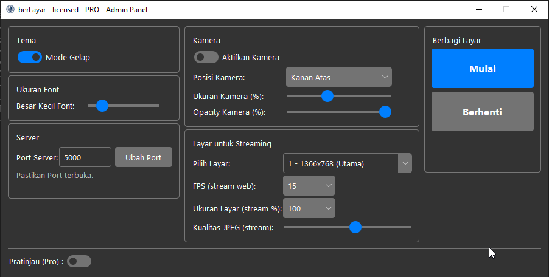

# Apa itu berLayar – Berbagi Layar Secara Lokal??

**berLayar** adalah aplikasi ringan untuk berbagi tampilan layar komputer Anda secara **lokal** ke perangkat lain melalui browser, tanpa perlu koneksi internet atau instalasi tambahan di sisi penerima.

Aplikasi ini berjalan secara **offline** di jaringan lokal (LAN/WiFi), dan dapat diakses melalui browser seperti Google Chrome, Edge, Firefox, atau Safari dari perangkat lain (laptop, tablet, atau ponsel).

---

## Fitur

- **Streaming langsung** tampilan layar Anda ke perangkat lain
- **Akses melalui browser** — tidak perlu instal di client
- **Tidak butuh internet**, cukup berada di jaringan yang sama
- **Bisa dikustomisasi** (logo, teks, dan tampilan halaman)
- Privasi terjaga karena hanya berjalan di jaringan lokal Anda

## Produk berLayar

### 1) Lite Edition (Windows)
- **Tanpa GUI** (berjalan di console).
- Hanya membagikan layar utama.
- Tidak ada pilihan monitor, FPS, kualitas, kamera, atau kustomisasi.
- **Menghentikan:** tutup jendela console.
- Cocok untuk **PC/laptop low-end** dan penggunaan cepat.

### 2) Pro Edition (Windows)
- **GUI Admin Panel** lengkap.
- Pilih monitor, atur FPS/kualitas/skala.
- **Kamera PiP** (posisi/ukuran/opacity).
- **Pratinjau** sebelum berbagi layar (toggle).
- Tema gelap/terang & ukuran font.
- Info **IP:PORT** & **timer durasi**.
- Kustomisasi tampilan viewer (`index.html`, logo, dsb.).
- **Stop** via GUI atau dengan menutup console.

### 3) Exclusive Build — Platform Edition (macOS/Linux)
- Build **khusus** untuk **macOS**/**Linux** (non-publik; by request).
- **Fitur setara Pro Edition**, disesuaikan dengan platform target.
- Proses integrasi/penyesuaian dilakukan secara manual.

> **Catatan:** **Pro Edition** dan **Exclusive Build (Platform Edition)** memiliki **fitur yang sama**. Perbedaannya hanya **platform** (Windows vs macOS/Linux) dan **model distribusi** (publik vs khusus).

---

## Spesifikasi Sistem

> Fokus utama rilis publik saat ini adalah **Windows**. Paket Exclusive Build melayani macOS/Linux secara khusus (non-publik).

| Paket | OS | CPU Minimal | RAM | Display | Jaringan | Catatan |
|------|----|-------------|-----|---------|----------|---------|
| **Lite** | Windows 10/11 (64-bit) | Dual-core i3 gen4 / setara | 2 GB (disarankan 4 GB) | 1366×768 | Wi-Fi 4 / LAN | Tidak perlu kamera |
| **Pro** | Windows 10/11 (64-bit) | Dual-core i3 gen6 / Ryzen 3 | 4 GB (disarankan 8 GB) | 1920×1080 | Wi-Fi 5/6 / LAN Gigabit | **Perlu Kamera** |
| **Exclusive Build** | macOS / Linux | Setara Pro | Sesuai OS | Sesuai OS | Sesuai OS | **Kamera dapat menyesuaikan** |

---
## Perbandingan Fitur — Lite vs Pro

> **Pro** dan **Exclusive Build** setara fitur. Untuk paket **Exclusive Build**, rujuk kolom **Pro**.
<table>
  <thead>
    <tr>
      <th style="text-align:left;">Fitur</th>
      <th style="text-align:center;">Lite</th>
      <th style="text-align:center;">Pro</th>
    </tr>
  </thead>
  <tbody>
    <tr>
      <td>Jalankan dengan double-click</td>
      <td style="text-align:center;">✔</td>
      <td style="text-align:center;">✔</td>
    </tr>
    <tr>
      <td>Streaming layar</td>
      <td style="text-align:center;">✔</td>
      <td style="text-align:center;">✔</td>
    </tr>
    <tr>
      <td>GUI Admin Panel</td>
      <td style="text-align:center;">✖</td>
      <td style="text-align:center;">✔</td>
    </tr>
    <tr>
      <td>Pilih monitor yang ingin dibagikan</td>
      <td style="text-align:center;">✖</td>
      <td style="text-align:center;">✔</td>
    </tr>
    <tr>
      <td>Atur FPS</td>
      <td style="text-align:center;">✖</td>
      <td style="text-align:center;">✔</td>
    </tr>
    <tr>
      <td>Atur kualitas gambar</td>
      <td style="text-align:center;">✖</td>
      <td style="text-align:center;">✔</td>
    </tr>
    <tr>
      <td>Atur skala ukuran layar</td>
      <td style="text-align:center;">✖</td>
      <td style="text-align:center;">✔</td>
    </tr>
    <tr>
      <td>Integrasi kamera</td>
      <td style="text-align:center;">✖</td>
      <td style="text-align:center;">✔</td>
    </tr>
    <tr>
      <td>Atur posisi/ukuran/opacity kamera</td>
      <td style="text-align:center;">✖</td>
      <td style="text-align:center;">✔</td>
    </tr>
    <tr>
      <td>Pratinjau sebelum berbagi layar</td>
      <td style="text-align:center;">✖</td>
      <td style="text-align:center;">✔</td>
    </tr>
    <tr>
      <td>Timer durasi sesi</td>
      <td style="text-align:center;">✖</td>
      <td style="text-align:center;">✔</td>
    </tr>
    <tr>
      <td>Kustomisasi <code>index.html</code> & logo viewer</td>
      <td style="text-align:center;">✖</td>
      <td style="text-align:center;">✔</td>
    </tr>
  </tbody>
</table>

---

## Tampilan
**Console — Lite Edition**  


**GUI — Pro Edition (Dark)**  


**Viewer — Browser Client**  


---

## Cara Menggunakan

### Lite Edition

1. **Jalankan file `berLayar.exe`**  
   (cukup klik dua kali)

2. Setelah terbuka, aplikasi akan menampilkan alamat IP lokal seperti:
   ```bash
    Akses aplikasi dari web browser dan masukkan URL:
    192.168.1.10:2025 (ini hanya contoh, IP akan menyesuaikan dengan subnet router/jaringan Anda)

3. **Buka browser di perangkat lain** (yang terhubung ke jaringan WiFi/LAN yang sama), lalu akses:
   ```bash
    http://192.168.1.10:2025

4. Anda akan melihat tampilan layar dari komputer pengirim secara langsung di browser.
   Catatan: Pastikan firewall tidak memblokir koneksi ke port 2025.

### Pro Edition
1. **Double-click `berLayar.exe`**
	(cukup klik dua kali)

2. **Atur parameter di GUI**
	Pilihan pada berLayar Pro memiliki pengaturan untuk monitor, FPS, kualitas, kamera, dsb.

3. Klik **Mulai**; alamat **IP:2025** tampil di panel.
	Informasi akan tampil di panel, terdapat juga informasi waktu berjalan.

4. Buka alamat itu di browser perangkat lain.

5. **Berhenti:** klik **Berhenti** atau tutup console.

---

## Akses dari Perangkat Viewer

- Pastikan host & viewer di **jaringan yang sama**.
- Buka browser di perangkat viewer masukkan `http://IP:2025` pada kolom browser (URL).

---

## Tips Kinerja

- **Lite:** cocok untuk perangkat spesifikasi minim.
- **Pro/Exclusive:** kurangi FPS/kualitas/skala bila performa rendah.
- Gunakan LAN/Wi-Fi 5/6 untuk latensi lebih rendah.
- Kamera akan menaikkan beban encode, pastikan komputer dan router anda terjamin.

---

## Keamanan
- Ditujukan untuk **jaringan lokal**.
- Hindari membagikan IP di jaringan publik tanpa proteksi.
- Matikan aplikasi saat tidak digunakan (Menutup GUI/Console).

---

## Kontak

Ingin versi khusus dengan logo dan teks Anda sendiri?

WhatsApp: **+62899-2277-917**  
Email: rheomie@gmail.com

---

## Lisensi

Aplikasi **Lite Edition** tersedia secara gratis untuk penggunaan pribadi dan edukasi.  
Untuk **Pro Edition & Exclusive Build (Platform Edition):** Silakan hubungi kami untuk kebutuhan kustomisasi atau penggunaan komersial.
